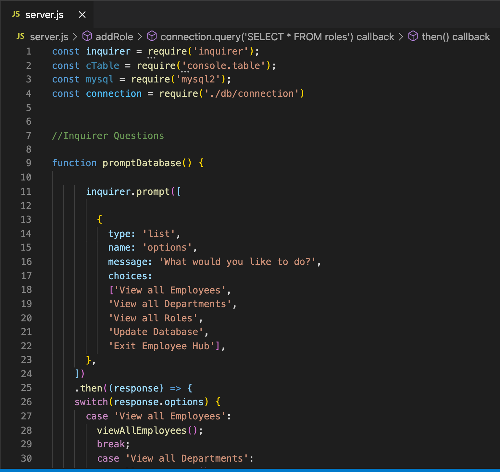
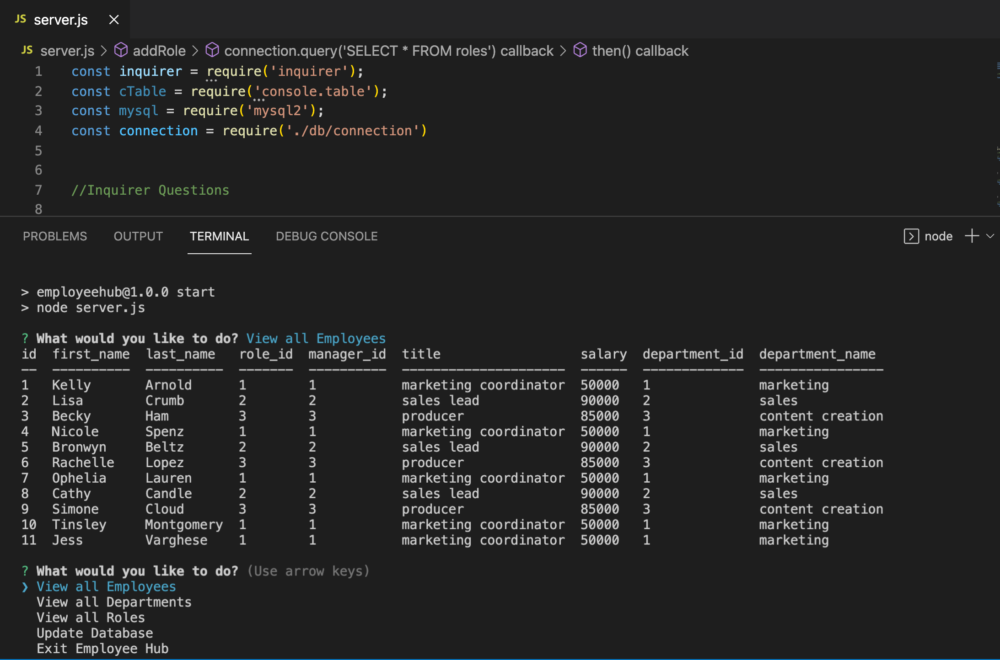

  # Employee Hub 
  
  )
  
  ## Description
  The Employee Hub allows user to view a database of employee. The user is prompted by options to how they would like to view the database or make updates.
  
[Deployed application](https://github.com/JessVarghese/EmployeeHub)

  ## Table of Contents

  * [Installation](#Installation)
  * [Dependencies](#dependencies)
  * [Visuals](#usage)
  * [License](#license)
  * [Contributions](#contributing)
  * [Questions](#questions)
 

  ## Installation
  gh repo clone JessVarghese/EmployeeHub
  
  
 
  ## Dependencies
  npm i, npm install inquirer, npm install mysql, npm install --save mysql2, npm install inquirer, npm install console.table --save
  
  ## Visuals
 
 

  ## License
  This project operates under the [MIT](https://choosealicense.com/licenses/MIT/) license.

  ## Contributing
  Open to suggestions on new features

  ## Questions
  If you have any questions about the repo, open and issue or contact me directly:
  * Email: jessvarghese@gmail.com
  * Github: https://github.com/JessVarghese

